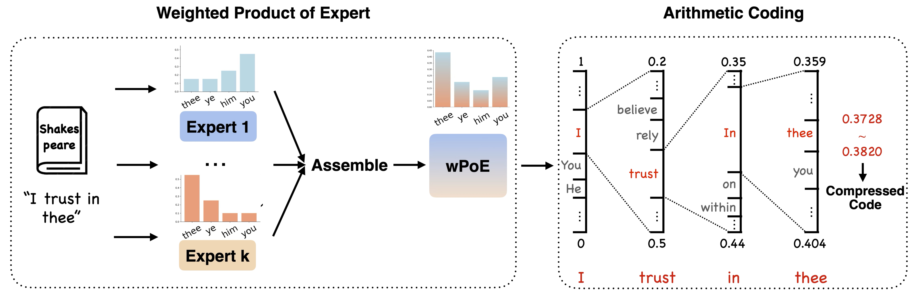

# Test-Time Steering for Lossless Text Compression via Weighted Product of Experts

<p align="center">
  <a href="https://blog.qihang-zhang.com/2025/10/15/weighted-product-of-experts" target="_blank">
  
  </a>
  <a href="https://aclanthology.org/2025.findings-emnlp.110/" target="_blank">
    
  </a>
</p>



This repository provides an implementation of our EMNLP 2025 paper [Test-Time Steering for Lossless Text Compression via Weighted Product of Experts](https://aclanthology.org/2025.findings-emnlp.110/).

> Lossless compression techniques are crucial in an era of rapidly growing data. Traditional universal compressors like gzip offer low computational overhead, high speed, and broad applicability across data distributions. However, they often lead to worse compression rates than modern neural compressors, which leverage large-scale training data to model data distributions more effectively. Despite their advantages, neural compressors struggle to generalize to unseen data. To address this limitation, we propose a novel framework that performs Test-Time Steering via a Weighted Product of Experts (wPoE). At inference, our method adaptively combines a universal compression model with a pretrained neural language model, ensuring the compression rate is at least as good as that of the best individual model. Extensive experiments demonstrate that our approach improves the performance of text compression without requiring fine-tuning. Furthermore, it seamlessly integrates with any autoregressive language model, providing a practical solution for enhancing text compression across diverse data distributions.

## Prerequisites

### Install uv

For Linux/MacOS, you can install `uv` via the following command:

```bash
curl -LsSf https://astral.sh/uv/install.sh | sh
```

For more details please see the [uv installation guide](https://docs.astral.sh/uv/getting-started/installation/).

### Install dependencies

```bash
uv sync
```

## Usage

### Train a vanilla decoder-only transformer

```bash
uv run transfomer_train.py --dataset enwik8 --embedding_dim 64 --model_type transformer
```

Or use the provided training scripts:

```bash
dim="64"  # set the model dimension here
bash example_scripts/train/enwik8_train_${dim}.sh
```

### Optimize alpha parameter with weighted product of experts

```bash
uv run weighted_product_of_experts.py --dataset enwik8 --embedding_dim 64 --model_type transformer
```

### Reproduce main table results

i.e., the results of 2-experts ensembles.

#### Reproduce the results of vanilla decoder-only transformer

```bash
bash example_scripts/alpha_optimize/alpha_optimize_transformer.sh
```

#### Reproduce the results of LLMs

```bash
bash example_scripts/alpha_optimize/alpha_optimize_llm.sh
```

## Cite this work
```
@inproceedings{zhang-etal-2025-test,
    title = "Test-Time Steering for Lossless Text Compression via Weighted Product of Experts",
    author = "Zhang, Qihang  and
      Li, Muchen  and
      Wang, Ziao  and
      Liao, Renjie  and
      Wang, Lele",
    editor = "Christodoulopoulos, Christos  and
      Chakraborty, Tanmoy  and
      Rose, Carolyn  and
      Peng, Violet",
    booktitle = "Findings of the Association for Computational Linguistics: EMNLP 2025",
    month = nov,
    year = "2025",
    address = "Suzhou, China",
    publisher = "Association for Computational Linguistics",
    url = "https://aclanthology.org/2025.findings-emnlp.110/",
    pages = "2076--2088",
    ISBN = "979-8-89176-335-7",
    abstract = "Lossless compression techniques are crucial in an era of rapidly growing data. Traditional universal compressors like gzip offer low computational overhead, high speed, and broad applicability across data distributions. However, they often lead to worse compression rates than modern neural compressors, which leverage large-scale training data to model data distributions more effectively.Despite their advantages, neural compressors struggle to generalize to unseen data. To address this limitation, we propose a novel framework that performs Test-Time Steering via a Weighted Product of Experts (wPoE).At inference, our method adaptively combines a universal compression model with a pretrained neural language model, ensuring the compression rate is at least as good as the best individual model.Extensive experiments demonstrate that our approach improves the performance of text compression without requiring fine-tuning. Furthermore, it seamlessly integrates with any autoregressive language model, providing a practical solution for enhancing text compression across diverse data distributions."
}
```


## Acknowledgement

Thanks for [language modeling is compression](https://github.com/google-deepmind/language_modeling_is_compression) from Google DeepMind for the baseline codebase of neural compression. We also follow their basic experiment settings.
